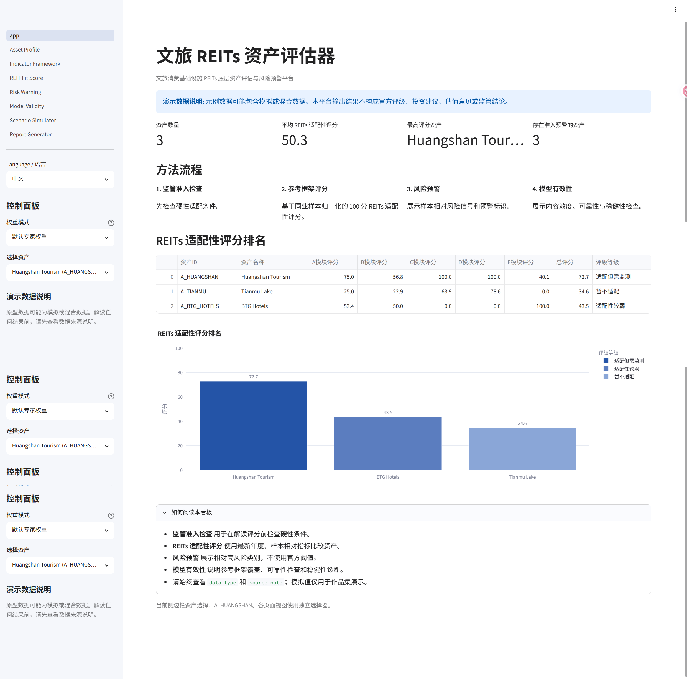
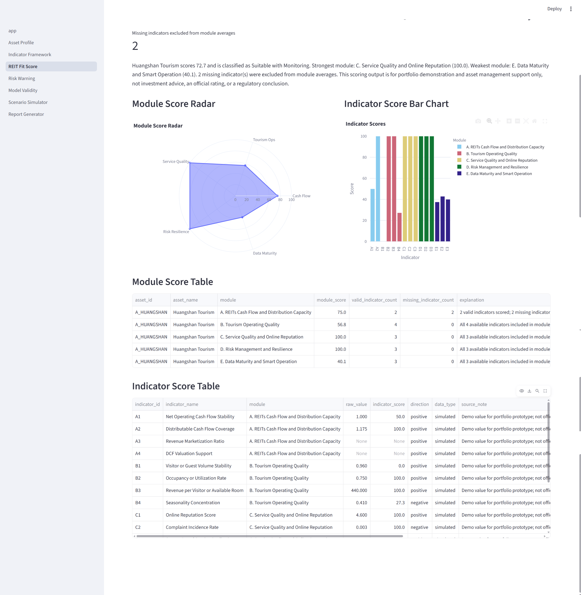
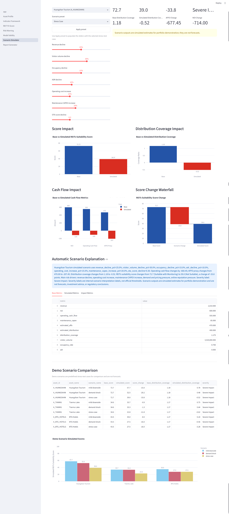
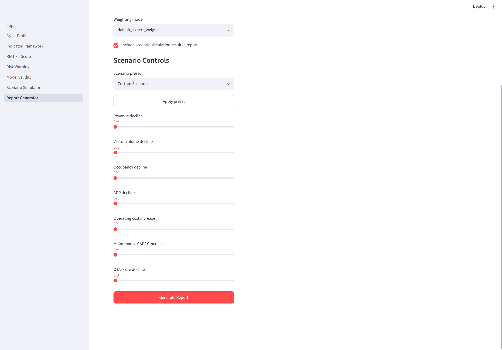

# Tourism REIT Asset Evaluator

文旅消费基础设施 REITs 底层资产评估与风险预警平台

**Live Demo:** https://tourism-reit-asset-evaluator-slsuamhgrgxskvdnoyns3a.streamlit.app/

**GitHub Repository:** https://github.com/lukamaul777-cyber/tourism-reit-asset-evaluator

## Project Overview

Tourism REIT Asset Evaluator is a Streamlit-based data product for evaluating the REITs suitability and risk profile of tourism-related consumption infrastructure assets, including scenic areas, resort complexes, and hotel assets.

The project integrates regulatory-style gatekeeper checks, a reference-based 100-point scoring model, risk warning analytics, model reliability and validity checks, scenario simulation, and automatic report generation. It is designed as a transparent portfolio prototype rather than a black-box rating model.

This project sits at the intersection of digital tourism management, tourism asset operation, REITs suitability analysis, and risk analytics. It demonstrates how structured data, model documentation, validation checks, and product design can support asset-management communication.

## Problem Statement

Tourism assets may have high visibility, strong brand recognition, and strategic local value, but they do not necessarily have stable recurring cash flow. Seasonality, visitor volatility, service quality, policy exposure, weather and climate risk, and platform dependency can all affect asset performance.

Public infrastructure REITs underlying assets require stable operating cash flow, clear ownership or operation rights, and controllable risk. For tourism-related infrastructure, managers need a transparent decision-support tool to compare asset suitability, identify weak operating dimensions, and explain risk pressure in a structured way.

## Key Features

- **Regulatory Gatekeeper**: binary pre-screen for key REITs suitability conditions.
- **Reference-Based REITs Suitability Score**: 100-point scoring model across five modules.
- **Tourism Operation and Service Quality Analysis**: visitor, occupancy, RevPAR, OTA score, survey-scale, and complaint indicators.
- **Risk Warning Dashboard**: sample-relative risk metrics and warning interpretation.
- **Model Reliability / Validity / Robustness Checks**: content validity, Cronbach's Alpha, AHP status, and weight sensitivity analysis.
- **Scenario Simulator**: stress-test style revenue, demand, cost, CAPEX, and reputation shocks.
- **Automatic Report Generator**: deterministic Markdown asset reports.
- **Data Validation and Configuration Validation**: scripts for checking model config and CSV data templates.

## Product Workflow

```text
Data Input -> Regulatory Gatekeeper -> Scoring Model -> Risk Warning -> Model Validity -> Scenario Simulation -> Report Generation
```

## Methodology

The model uses a two-layer structure. The first layer is the **Regulatory Gatekeeper**, which checks hard pre-screening conditions such as ownership or operation rights, legal disputes, operating history, cash-flow stability, market-based cash-flow source, and distribution capacity.

The second layer is the **100-point REITs Suitability Score**, which compares assets across five modules: cash flow and distribution capacity, tourism operating quality, service quality and online reputation, risk management and resilience, and data maturity and smart operation.

The scoring model uses peer min-max normalization. Positive indicators reward higher values relative to the sample, while negative indicators reward lower values. Missing indicator values return missing scores and are excluded from module averages instead of being replaced with fabricated values.

Supported weighting modes include `default_expert_weight`, `equal_weight`, and an `entropy_weight_placeholder` reserved for future use with a larger verified dataset. Reliability and validity checks include content validity review, Cronbach's Alpha for service-quality multi-item data only, AHP consistency when a pairwise matrix is provided, and ranking stability under weight perturbation.

## Reference Frameworks

The project is informed by established regulatory, industry, academic, and management frameworks, including:

- CSRC / NDRC public infrastructure REITs guidance
- NAREIT FFO/AFFO concepts
- EPRA / INREV performance measurement concepts
- UN Tourism accommodation statistics
- SERVQUAL / HOLSERV / DINESERV
- ISO 31000 / COSO ERM
- TCFD / IFRS S2
- GB/T 36073 DCMM
- Smart tourism management requirements

See [docs/references.md](docs/references.md) and [config/model_references.yml](config/model_references.yml) for the project reference library. This README does not invent precise citations beyond the documented reference framework names.

## Data Sources and Data Disclaimer

Annual reports, prospectuses, operating reports, valuation reports, and public disclosures can support financial and operating fields when directly verified. OTA platforms, public review sites, map platforms, and public web sources can support online reputation and customer experience indicators when collected with documented methods.

The MVP dataset is a portfolio demonstration template. Some values are marked `simulated` or `mixed`; these values are explicitly labeled through `data_type` and `source_note` columns in every table.

Demo data should not be interpreted as official disclosed data. Model outputs are not investment advice, credit ratings, valuation opinions, or official regulatory conclusions.

## App Pages

- **Home**: project overview, methodology flow, KPI cards, and score ranking.
- **Asset Profile**: asset description, source notes, gatekeeper results, financial metrics, and operation metrics.
- **Indicator Framework**: indicator definitions, module filters, data source types, reference notes, and content-validity support.
- **REIT Fit Score**: total score, rating level, module scores, indicator scores, and generated score explanation.
- **Risk Warning**: risk category cards, radar chart, heatmap, and gatekeeper warning explanation.
- **Model Validity**: content validity, reliability, AHP status, sensitivity analysis, and limitations.
- **Scenario Simulator**: interactive stress-test estimates for score, cash flow, AFFO proxy, and distribution coverage.
- **Report Generator**: deterministic Markdown report generation with optional scenario inclusion and downloads.

## Project Structure

```text
tourism-reit-asset-evaluator/
|-- app.py
|-- config/
|   |-- indicator_framework.yml
|   |-- model_references.yml
|   `-- scoring_weights.yml
|-- data/
|   |-- assets.csv
|   |-- financial_metrics.csv
|   |-- operation_metrics.csv
|   |-- service_quality_metrics.csv
|   |-- risk_metrics.csv
|   |-- digital_maturity_metrics.csv
|   `-- data_dictionary.csv
|-- docs/
|   |-- data_notes.md
|   |-- github_about.md
|   |-- indicator_system.md
|   |-- model_methodology.md
|   |-- portfolio_summary.md
|   |-- references.md
|   `-- screenshots/
|-- pages/
|   |-- 1_Asset_Profile.py
|   |-- 2_Indicator_Framework.py
|   |-- 3_REIT_Fit_Score.py
|   |-- 4_Risk_Warning.py
|   |-- 5_Model_Validity.py
|   |-- 6_Scenario_Simulator.py
|   `-- 7_Report_Generator.py
|-- reports/
|   |-- report_A001.md
|   |-- report_A002.md
|   `-- report_A003.md
|-- scripts/
|   |-- final_check.py
|   |-- run_model_validity_checks.py
|   |-- validate_data_files.py
|   `-- validate_project_config.py
|-- src/
|   |-- chart_utils.py
|   |-- data_loader.py
|   |-- gatekeeper.py
|   |-- reliability_validity.py
|   |-- report_generator.py
|   |-- scenario_simulator.py
|   `-- scoring_model.py
|-- LICENSE
|-- requirements.txt
`-- README.md
```

## How to Run

Install dependencies:

```powershell
python -m pip install -r requirements.txt
```

Run validation and backend checks:

```powershell
python scripts/validate_project_config.py
python scripts/validate_data_files.py
python src/gatekeeper.py
python src/scoring_model.py
python scripts/run_model_validity_checks.py
python src/scenario_simulator.py
python src/report_generator.py
```

Launch the Streamlit app:

```powershell
python -m streamlit run app.py
```

## Deployment

This app is deployment-ready for Streamlit Community Cloud from a GitHub repository.

- Live Streamlit App: https://tourism-reit-asset-evaluator-slsuamhgrgxskvdnoyns3a.streamlit.app/
- Main file path: `app.py`
- Dependencies are listed in `requirements.txt`.
- Recommended local run command: `python -m streamlit run app.py`

## Screenshots

### Home Dashboard

Project overview with KPI cards, methodology flow, and total score ranking.



### REIT Fit Score

Asset-level REITs suitability score with module breakdown and radar chart.



### Scenario Simulator

Stress-test controls and scenario impact outputs for a representative asset.



### Report Generator

Rule-based generated report preview with Markdown/TXT download options.



## Limitations

- The demo dataset size is small.
- Some indicators are simulated or mixed.
- Peer normalization depends on the available sample.
- The scenario simulator uses simplified stress-test assumptions.
- Model validity is limited by demo data and small sample size.
- Results are not investment advice, credit ratings, valuation opinions, or regulatory conclusions.

## Future Improvements

- Replace demo data with verified annual report data.
- Add real OTA and public review data extraction.
- Add a larger tourism asset peer group.
- Implement entropy weighting with a larger verified dataset.
- Add PDF and Word report export.
- Add richer deployment documentation and user testing notes.

## Author / Role

Project role: digital tourism management analytics, product design, scoring model design, Streamlit dashboard development, risk analytics, and report automation.

## Disclaimer

This project is generated for portfolio demonstration and asset management support. It is not investment advice, a credit rating, a valuation opinion, or an official regulatory conclusion. Demo data may include simulated or mixed values and should not be interpreted as official disclosed data.
